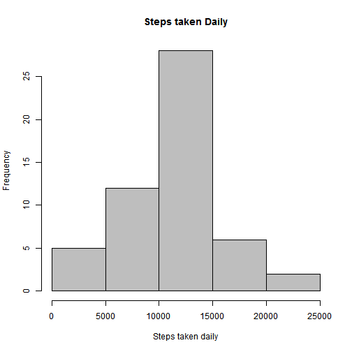
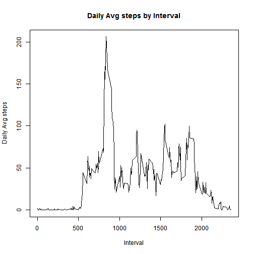
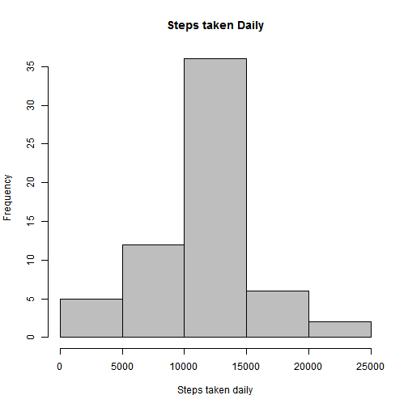
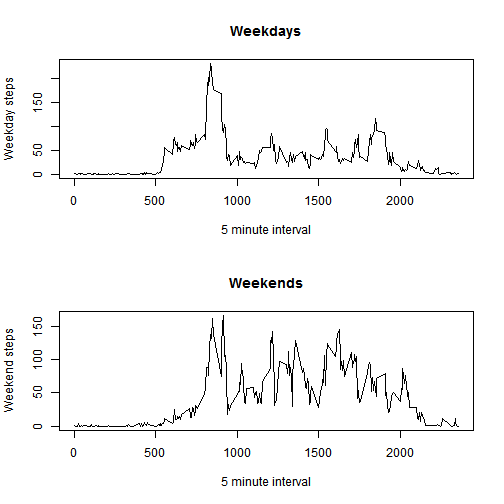

---
# PA1_Template (Reproducible Research, Week 2)

### Author: "SB"
### date: "Tuesday, May 12, 2015"

The first step is to download the .zip file locally into the working directory and load it into a data frame.

- Install 'downloader' package

- download .zip file locally, and unzip it

- read.csv into a dataframe

____________________________________________________________________________________________________

### Let us now sum the steps by each day and create a histogram

 

### Calculate the Mean and Median steps taken per day

Mean: 1.0766189 &times; 104

Median: 10765

_____________________________________________________________________________________________________

### Make a plot for Average Daily Pattern of steps taken each day

 

Highest steps are in 835 Interval

_____________________________________________________________________________________________________

### Take a stock of missing values in the data set

There are a total of 2304 elements that have missing values in the data set

Lets consider filling up the missing values with the mean for that interval

 

Mean Old: 1.0766189 &times; 104 

Mean New: 1.0766189 &times; 104

Shift in Mean: 0

Median Old: 10765

Median New: 1.0766189 &times; 104

Shift in Median: 1.1886792
___________________________________________________________________________________________________

 

As per data seems like there is more physical activity during the weekends, as compared to weekdays.
